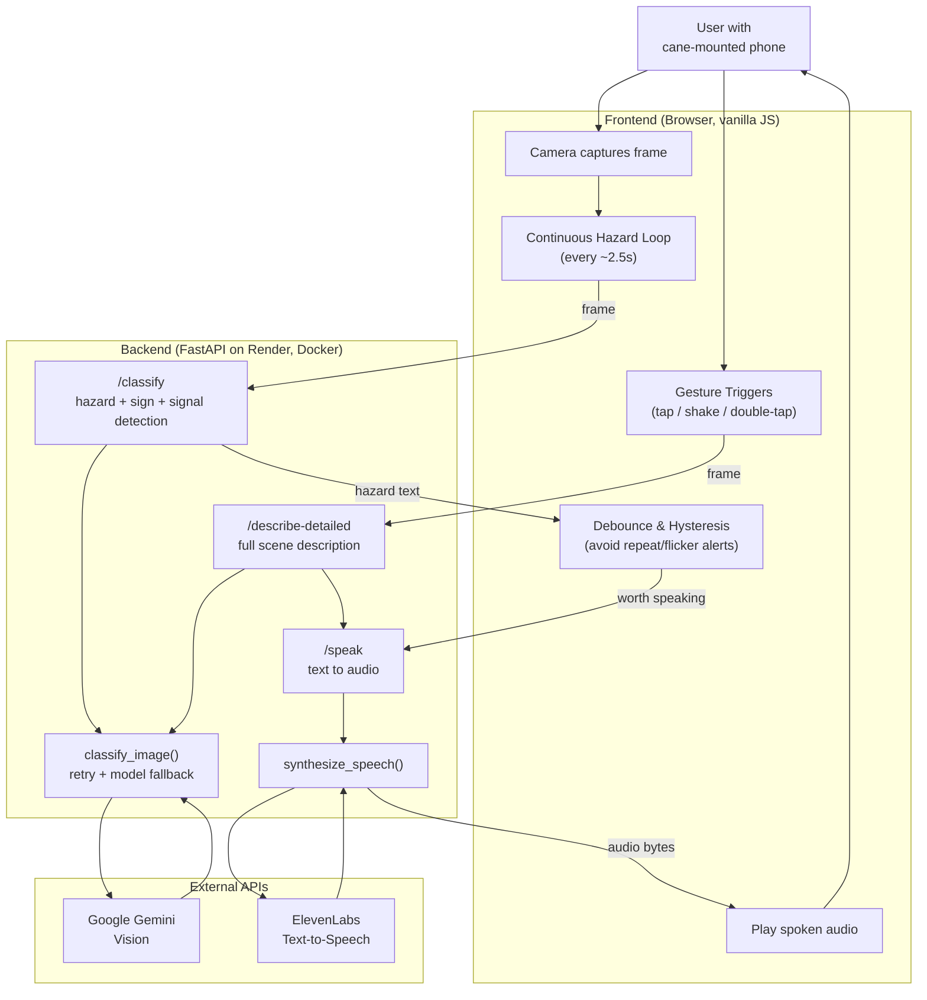

# iCane

A phone-camera walk-assist cane that gives blind and low-vision users real-time awareness of their surroundings.

iCane turns a standard cane into a smart navigation aid by mounting a phone to the cane. The phone camera observes the path ahead, a vision model identifies relevant hazards, signs, and traffic signals, and text-to-speech delivers concise, actionable audio feedback — not just descriptions, but instructions on what to do.

## Live Demo

**[Try it here](https://icane-hophacks-2026-1.onrender.com)** — open it on a phone and grant camera, microphone, and motion permissions when prompted. Works best in Chrome on iOS or Android.

> Note: the backend is hosted on Render's free tier, which spins down after inactivity — the first request after a while may take 30-60 seconds to wake up.

## How It Works

1. Attach a phone to the cane with a simple clamp.
2. Open the web app — no download or install needed.
3. Tap anywhere on the screen to start monitoring (no need to see or aim for a button).
4. The camera continuously scans the path ahead, and iCane speaks up only when something changes — hazards, signs, or crossing signals.
5. Request a fuller description of the surroundings at any time with a shake, a double-tap anywhere on the screen, or the visible button.

## Capabilities

**Hazard detection with actionable guidance.** Rather than just naming what's ahead, iCane tells the user what to do about it:
- Hazard on the left → move right; hazard on the right → move left
- Something approaching head-on (a person, a vehicle) → stop
- Stairs going up → climb carefully; stairs going down → step down carefully
- Low overhangs, doors, curbs, and general path clutter

**Sign reading.** Recognizes and reads aloud nearby Entrance, Exit, Restroom, Emergency Exit, and Danger signs, including their rough direction (e.g. "Exit sign ahead on the right").

**Pedestrian traffic signal detection.** At a crosswalk, iCane reads the signal and tells the user when to stop and when to walk — including the countdown timer when it's clearly legible, so the user knows how much time is left to cross.

**On-demand full description.** A slower, more detailed narration of the whole scene — layout, notable objects, people, and hazards — triggered by the button, a double-tap anywhere on the screen, or a deliberate shake (tuned to ignore the incidental jostling of normal cane use).

**Built for accessibility from the ground up.** No precise tapping required to start or interact — a single tap anywhere begins monitoring, and every trigger works without being able to see the screen. An audible confirmation plays the moment monitoring starts, so the user always knows the app is active.

## Tech Stack

- **Backend:** FastAPI (Python), deployed on Render
- **Vision:** Google Gemini for real-time scene classification and description
- **Voice:** ElevenLabs for low-latency text-to-speech
- **Frontend:** Vanilla HTML/CSS/JavaScript — a single-page web app, no install required, works directly in the phone's browser

## Architecture



## Running Locally

**Backend:**
```
pip install -r requirements.txt --break-system-packages
uvicorn main:app --reload --port 8000
```
You'll need a `.env` file with `GEMINI_API_KEY` and `ELEVENLABS_API_KEY` set.

**Frontend:**
Open `icane-frontend/index.html` in a browser, or serve it from any static host. Update `BASE_URL` in the file to point at your backend.

## Team

Built at HopHacks Fall 2026 at Johns Hopkins University by Tanmay Katke, Abhishek Thakkar, Yakshil Patel, and Abigail Chen.