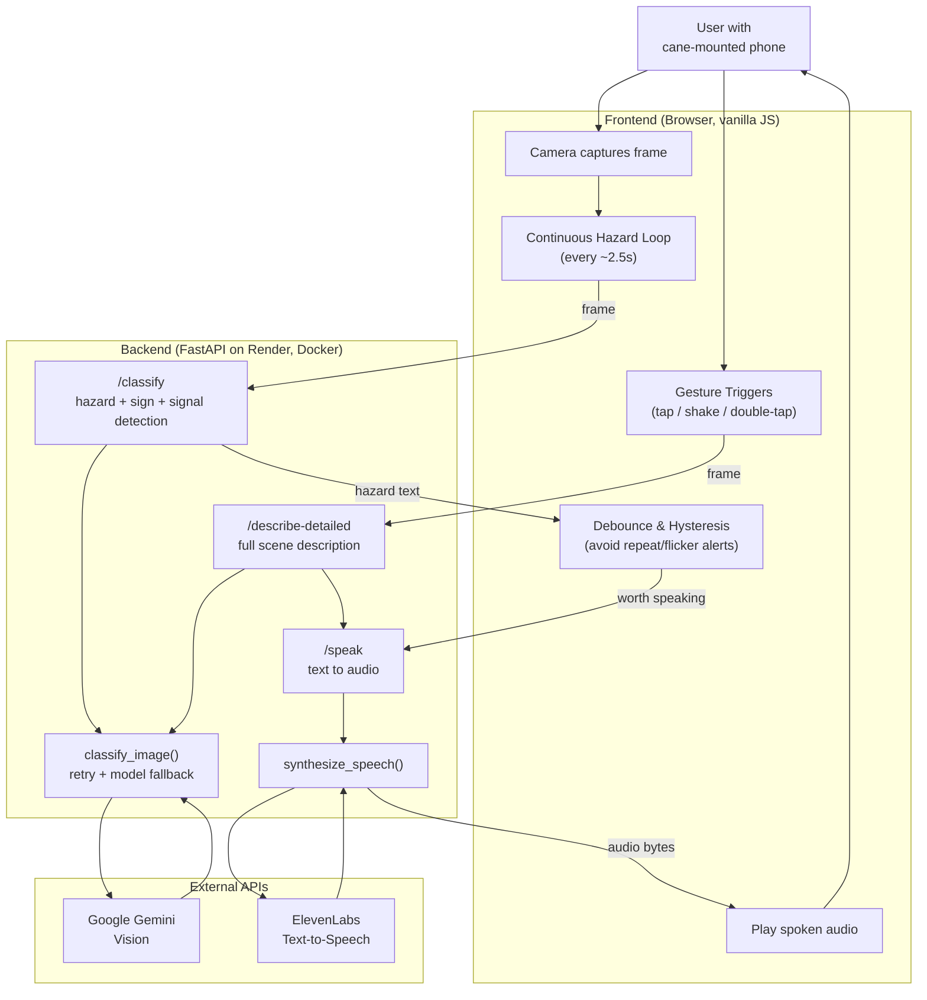

# iCane

A phone-camera walk-assist cane that gives blind and low-vision users real-time awareness of their surroundings.

iCane turns a standard cane into a smart navigation aid by mounting a phone to the cane. The phone camera observes the path ahead, a vision model identifies relevant hazards, signs, and traffic signals, and text-to-speech delivers concise, actionable audio feedback — not just descriptions, but instructions on what to do.

## Live Demo

**[Try it here](https://icane-hophacks-2026-1.onrender.com)** — open it on a phone and grant camera, microphone, and motion permissions when prompted. Works best in Chrome on iOS or Android.

> Note: the backend is hosted on Render's free tier, which spins down after inactivity — the first request after a while may take 30-60 seconds to wake up.

## How It Works

1. Attach a phone to the cane with a simple clamp.
2. Open the web app — no download or install needed.
3. Tap anywhere on the screen to start monitoring (no need to see or aim for a button).
4. The camera continuously scans the path ahead, and iCane speaks up only when something changes — hazards, signs, or crossing signals.
5. Request a fuller description of the surroundings at any time with a shake, a double-tap anywhere on the screen, or the visible button.

## Capabilities

**Hazard detection with actionable guidance.** Rather than just naming what's ahead, iCane tells the user what to do about it:
- Hazard on the left → move right; hazard on the right → move left
- Something approaching head-on (a person, a vehicle) → stop
- Stairs going up → climb carefully; stairs going down → step down carefully
- Low overhangs, doors, curbs, and general path clutter

**Sign reading.** Recognizes and reads aloud nearby Entrance, Exit, Restroom, Emergency Exit, and Danger signs, including their rough direction (e.g. "Exit sign ahead on the right").

**Pedestrian traffic signal detection.** At a crosswalk, iCane reads the signal and tells the user when to stop and when to walk — including the countdown timer when it's clearly legible, so the user knows how much time is left to cross.

**On-demand full description.** A slower, more detailed narration of the whole scene — layout, notable objects, people, and hazards — triggered by the button, a double-tap anywhere on the screen, or a deliberate shake (tuned to ignore the incidental jostling of normal cane use).

**Built for accessibility from the ground up.** No precise tapping required to start or interact — a single tap anywhere begins monitoring, and every trigger works without being able to see the screen. An audible confirmation plays the moment monitoring starts, so the user always knows the app is active.

## Tech Stack

- **Backend:** FastAPI (Python), deployed on Render
- **Vision:** Google Gemini for real-time scene classification and description
- **Voice:** ElevenLabs for low-latency text-to-speech
- **Frontend:** Vanilla HTML/CSS/JavaScript — a single-page web app, no install required, works directly in the phone's browser

## Architecture



## Running Locally

**Backend:**
```
pip install -r requirements.txt --break-system-packages
uvicorn main:app --reload --port 8000
```
You'll need a `.env` file with `GEMINI_API_KEY` and `ELEVENLABS_API_KEY` set.

**Frontend:**
Open `icane-frontend/index.html` in a browser, or serve it from any static host. Update `BASE_URL` in the file to point at your backend.

## Known Limitations

**Google Gemini (Vision):**
- The free tier enforces a requests-per-minute rate limit; polling too aggressively returns `429` errors. The hazard-detection loop is paced (roughly every 2.5s) specifically to stay under this ceiling — a tradeoff of responsiveness for reliability.
- Google's servers occasionally return a transient `503` ("high demand") error under load. The backend retries once and falls back to a different model tier before giving up, since these spikes are usually brief.
- Reading fine print or small numbers from a single still frame — like a crosswalk countdown timer — is inherently unreliable for a vision model. The app is designed to omit an uncertain number rather than guess one and risk giving false confidence.
- `gemini-3.5-flash-lite` does not reliably process audio input; it can silently produce a plausible-sounding but wrong answer instead of erroring. Any feature needing audio understanding needs the full `gemini-3.5-flash` model instead.

**ElevenLabs (Text-to-Speech):**
- The free tier is capped at 10,000 characters/month. This is workable for a live demo but easy to exhaust during iterative development and testing — we hit this limit ourselves while building.
- The free tier has no commercial-use rights and no voice cloning.
- The app uses `eleven_flash_v2_5` rather than the more expressive `eleven_v3` model specifically for latency: v3 produces more natural-sounding speech, but with meaningfully slower generation time. For a safety device where response speed matters more than vocal polish, the faster model is the right tradeoff.

## Cost to Build

Hardware cost, assuming the user already owns a smartphone:

| Component | Cost |
|---|---|
| Cane | $10 |
| Phone mount/clamp | $5 |
| **Total incremental cost** | **$15** |
| Smartphone (one-time, only if not already owned) | ~$400–500 |

Since most users already carry a phone, iCane turns an existing device into a smart assistive tool for about **$15** in new hardware — not a purpose-built device that costs hundreds.

## Cost to Use

iCane runs on two metered APIs. Rates below are current as of September 2026 — see the [Gemini pricing page](https://ai.google.dev/gemini-api/docs/pricing) and [ElevenLabs pricing page](https://elevenlabs.io/pricing) for the latest.

**API rates:**

| API | Tier / Model | Price |
|---|---|---|
| Gemini | `gemini-3.5-flash-lite` (hazard detection) | $0.30 / 1M input tokens, $2.50 / 1M output tokens |
| Gemini | `gemini-3.5-flash` (fallback only) | $1.50 / 1M input tokens, $9.00 / 1M output tokens |
| Gemini | Image tokenization | Flat 258 tokens per image ≤384×384px |
| Gemini | Free tier | No charge, but capped at ~1,000 requests/day (comparable flash-lite models) — too low for a full day of continuous monitoring |
| ElevenLabs | Free | 10,000 credits/mo, no commercial-use rights |
| ElevenLabs | Starter | $6/mo, 30,000 credits, commercial-use rights |
| ElevenLabs | Creator | $11/mo, 121,000 credits, + voice cloning |
| ElevenLabs | Pro | $99/mo, 600,000 credits |

(1 ElevenLabs credit ≈ 1 character.)

### Estimated monthly cost for a daily blind user

**Usage assumptions** (adjust for a different pattern — the math scales linearly):

| Assumption | Value |
|---|---|
| Active cane use | 1.5 hours/day, 30 days/month |
| Hazard-loop polling interval | Every 2.5s while active |
| Spoken hazard alerts | ~1 every 2 minutes of walking, ~45 characters each |
| On-demand "describe surroundings" requests | 10/day, ~220 characters each |

**Gemini cost:**

| Item | Calls/month | Tokens/call (in / out) | Cost/call | Monthly cost |
|---|---|---|---|---|
| Hazard-detection loop | 1.5hr × 3,600s ÷ 2.5s = 2,160/day → 64,800/mo | 258 (image) + 430 (prompt) = 690 in / 20 out | (690÷1M×$0.30) + (20÷1M×$2.50) ≈ $0.00026 | **≈ $16.85** |
| On-demand descriptions | 10/day → 300/mo | ~370 in / ~55 out | ≈ $0.00025 | **≈ $0.08** |
| **Gemini total** | | | | **≈ $17/month** |

**ElevenLabs cost:**

| Item | Chars/day | Chars/month | Notes |
|---|---|---|---|
| Hazard alerts | 45/day × 45 chars = 2,025 | 60,750 | 1 alert every 2 min of the 90-min walk |
| Detailed descriptions | 10 × 220 = 2,200 | 66,000 | |
| **Total** | **4,225** | **≈ 127,000 credits** | Just above Creator's 121,000 cap → **Creator tier, $11/month** (occasional small top-up) |

**Total estimated cost:**

| | Monthly cost |
|---|---|
| Gemini | ≈ $17 |
| ElevenLabs (Creator) | ≈ $11 |
| **Total per daily user** | **≈ $28/month** |

That's on top of the one-time ~$15 hardware cost — still far cheaper than most dedicated assistive-navigation hardware, which commonly runs several hundred to a few thousand dollars. This is a back-of-envelope estimate based on the assumptions above; actual cost depends heavily on how much of a user's day is spent actively walking with the cane and how chatty the hazard loop turns out to be in practice.

## Team

Built at HopHacks Fall 2026 at Johns Hopkins University by Tanmay, Abhishek, Yakshil, and Abigail.